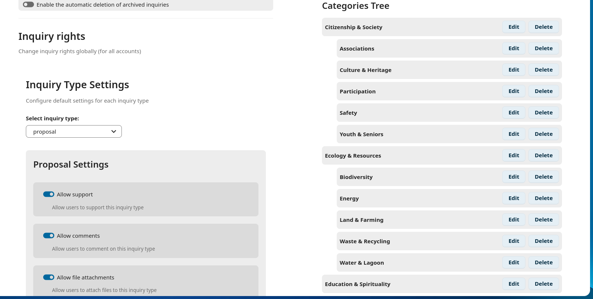
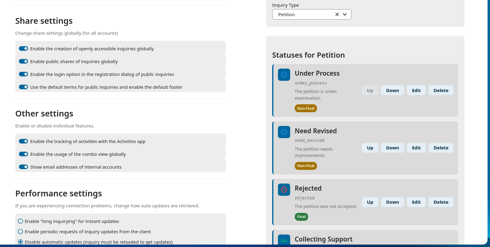

<!--
  - SPDX-FileCopyrightText: 2016 Nextcloud contributors
  - SPDX-License-Identifier: AGPL-3.0-or-later
-->

# Agora

This app has been built on top of [Nextcloud Polls](https://github.com/nextcloud/polls) 8.1.4.  
A big thanks to the original Polls contributors for creating this wonderful application.

Agora is a Nextcloud app for participatory democracy, inquiries, and proposals, similar to [Decidim](https://decidim.org/), written in PHP and JS/Vue.


[](https://dependabot.com)
[](COPYING)
[](https://api.reuse.software/info/github.com/vinimoz/agora)


## Installation / Update
This app is supposed to work on Nextcloud version 21+.

### Install latest release
You can download and install the latest release from the [Nextcloud app store](https://apps.vinimoz.com/apps/agora).

## Available occ commands
| Command | Description |
| - | - |
| `agora:db:clean-migrations`                                                  | Remove obsolete migrations, which are no more needed         |
| `agora:db:purge`                                                             | Drop Agora' tables and remove migration and settings records |
| `agora:db:rebuild`                                                           | Rebuild Agora' database including indices                    |
| `agora:db:init-default`                                                      | Create default valie                                         |
| `agora:index:create`                                                         | Create all necessary indices and foreign key constraints     |
| `agora:index:remove`                                                         | Remove all indices                                           |
| `agora:inquiry:transfer-ownership  <source-user> <target-user>`                 | Transfer inquiry ownership from  <source-user> to <target-user> |
| `agora:share:add [--user USER] [--group GROUP] [--email EMAIL] [--] <id>`    | Add user/group/email with <id> to shares                     |
| `agora:share:remove [--user USER] [--group GROUP] [--email EMAIL] [--] <id>` | Remove user/group/email with <id> from shares                |
## Support
- Report a bug or request a feature:  https://github.com/vinimoz/agora/issues
- Community support: https://help.vinimoz.com/c/apps/agora/

## Screenshots
Manage your agora and create new ones | Many configuration options | Share your inquiry with other people | Agora on mobile
:-:|:-:|:-:|:-:
 |  | ![View Inquiry ]](screenshots/UserViewInquiry.png) | ![Grid View ]](screenshots/GridView.png)


### Install from git
If you want to run the latest development version from git source, you need to clone the repo to your apps folder:

```
git clone https://github.com/vinimoz/agora.git
```

* Install dev environment with ```make setup-dev``` or
* install runtime environment with ```make setup-build```
* Compile javascript with ```npm run build```
* Run a complete build with ```make appstore``` (Find the output in the build directory)
* call `occ app:enable agora` to enable Agora

### Installation variants

### First time install
Nextcloud executes
* unexecuted `migration classes` (not listed in the `*_migrations` table) and the
* `install` repair step.

### After a version update (changed version attribute in appinfo/info.xml)
Nextcloud executes
* `pre-migration` repair steps,
* unexecuted `migration classes` (not listed in the `*_migrations` table) and the
* `post-migration` repair steps

### Enabling already installed but disabled app without version change
Nextcloud executes
* `pre-migration` repair steps,
* unexecuted `migration classes` (not listed in the `*_migrations` table) and the
* `post-migration` repair steps and the
* `install` repair step

❗ As a compromise at the moment we allow the index creation to be ran twice when enabling the app via app store or `occ`, to ensure all indexes are created properly for every install/update/enabling path.

## Removing Agora from instance
Call `occ agora:db:purge` to remove Agora completely.
* removes all Agora related tables
* removes all Agora related migration records
* removes all Agora related app config records (this also disables Agora)

This does not remove Agora' files (call `occ app:remove agora` to remove it complete afterwards) but it resets Agora into an 'uninstalled' state. Enabling the app is then equivalent to a first time install and calls the migration and the install repair step (see above).

## Contribution Guidelines
Please read the [Code of Conduct](https://vinimoz.com/community/code-of-conduct/). This document offers some guidance to ensure Nextcloud participants can cooperate effectively in a positive and inspiring atmosphere, and to explain how together we can strengthen and support each other.

For more information please review the [guidelines for contributing](https://github.com/vinimoz/server/blob/master/.github/CONTRIBUTING.md) to this repository.
