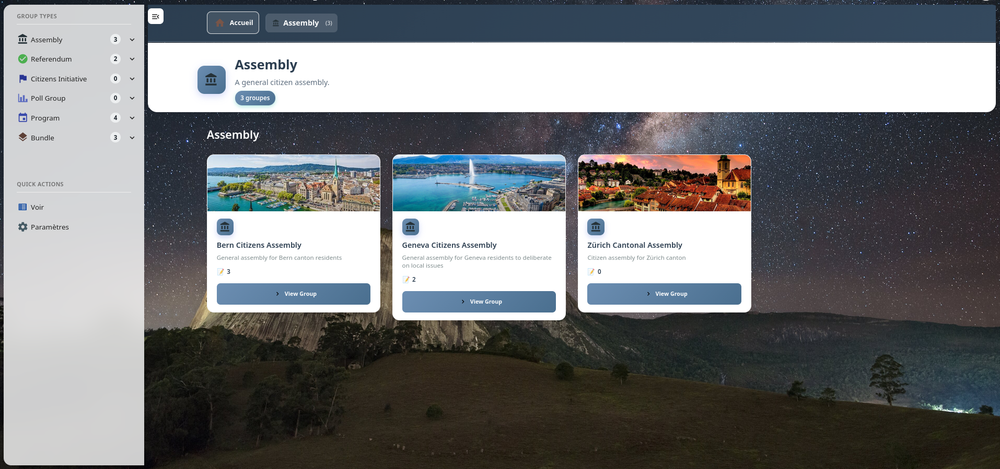
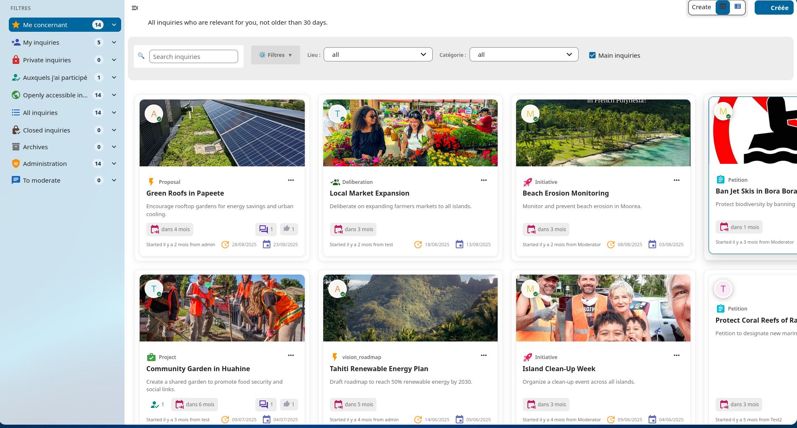
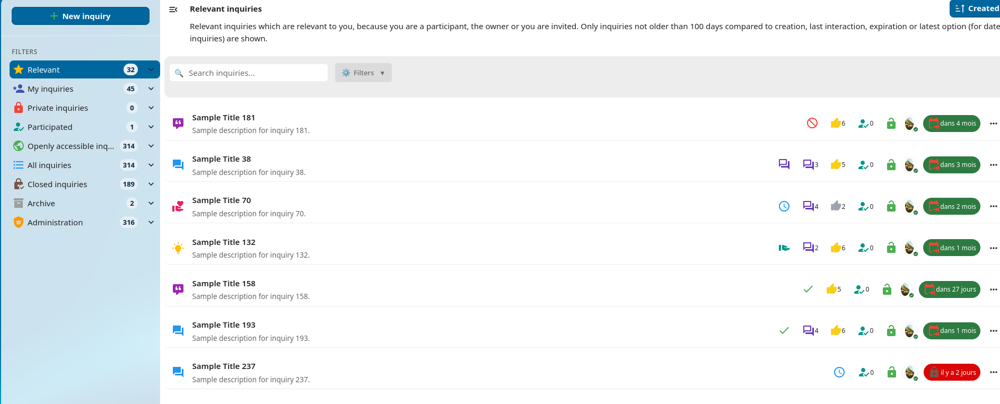
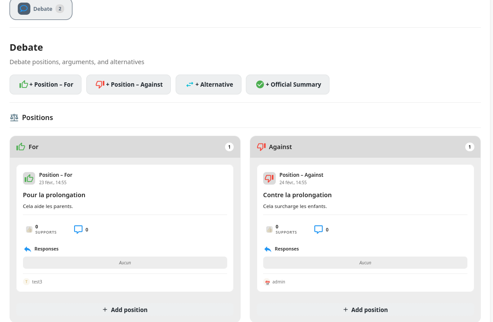
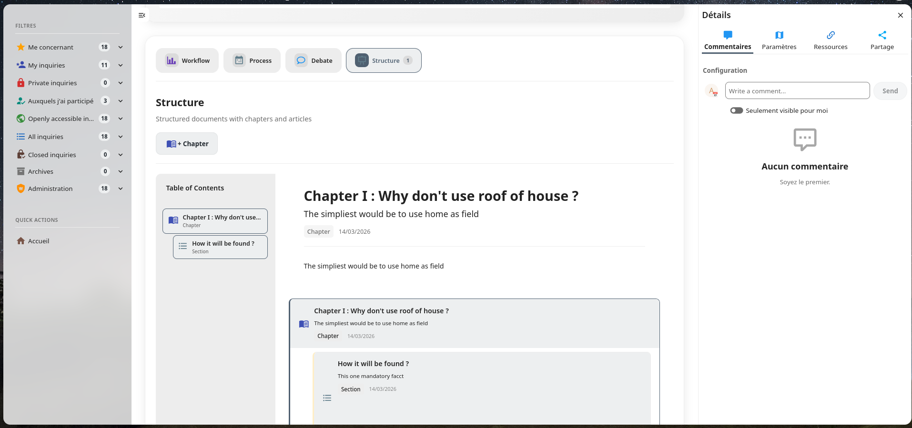
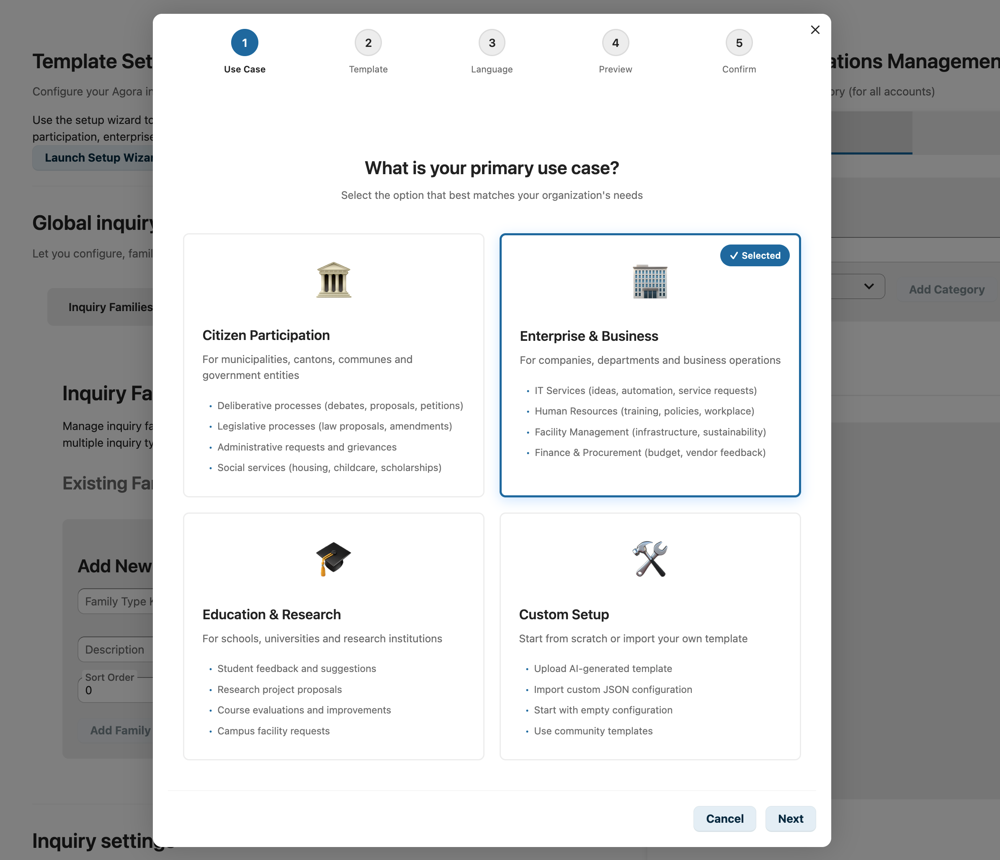

# Agora 1.7.5

[](https://dependabot.com/) [](COPYING) [](https://api.reuse.software/info/github.com/vinimoz/agora)

Agora is a **Nextcloud app for participatory democracy**, inspired by [Decidim](https://decidim.org/) and built on Nextcloud Polls. It enables communities, organizations, institutions, and citizen groups to collaborate on **proposals, debates, consultations, petitions, projects, and formal decision-making processes** in a transparent and structured way.


## 🚀 What's New in 1.7.5

Agora 1.7.5 introduces the largest evolution of the participation and voting system since the creation of the project.

The former support mechanism has been replaced by a unified **Support & Voting Engine** architecture. Deliberative participation and formal voting now share the same foundation while remaining adapted to different democratic processes.

### 🗳 Deliberative Supports
Supports are no longer limited to simple "for" or "against" interactions.

During the deliberation phase, administrators can now select different participation models:

- 👍 Binary support (Yes / No)

- ⚖️ Ternary support (For / Abstain / Against)

- ⭐ Star rating

- 🔢 Score voting

- 🧠 Majority Judgment

- ✅ Approval support

- ❤️ Reactions

- 🔥 Trending participation

- 💬 Pure discussion mode

This allows each inquiry, proposal, project, or option to use the most appropriate participation mechanism.

### 🏛 Advanced Voting Utilities
Agora now includes a much more complete voting toolkit for formal decision-making.

Available voting methods include:

- 🏆 Condorcet voting
  - Schulze
  - Copeland
  - Minimax
  - Ranked Pairs
  - Kemeny-Young

- 📊 Borda Count

- 🧠 Majority Judgment

- ✅ Approval Voting

- 📝 Ranked Choice Voting

- ⚡ Quadratic Voting

- ⚖️ Token / Weighted Voting

- 🔄 Phased Voting

This enables organizations to move beyond simple majority voting and adopt decision methods adapted to their governance needs.

### 🎯 Unified Architecture
The new engine architecture provides:

- Shared support and voting framework

- Flexible configuration templates

- Cross-option and per-option voting modes

- Multiple presentation layouts

- Configurable voting parameters

- Future extensibility for additional democratic methods


## ⚠️ IMPORTANT UPDATE NOTICE
### Backup Required Before Updating

**Agora 1.7.5 introduces a major redesign of the support system.**

The internal support architecture, storage model, and participation engines have been significantly modified.

#### Before upgrading:
1. Perform a complete Nextcloud backup

2. Backup your database

3. Backup your Agora application data

4. Test the update in a staging environment whenever possible

#### Warning
Administrators upgrading from previous versions should carefully verify:

- Existing supports

- Participation statistics

- Templates

- Inquiry configurations

- Custom integrations

Although migration scripts are provided, a full backup is strongly recommended before any production upgrade.

**Do not upgrade a production instance without a verified backup.**

## ✨ Key Features
- 💬 Comments and discussions
- 👍 Flexible support systems (binary, ternary, star rating, score, majority judgment, approval, reactions, trending, discussion-only)
- 🗳 Advanced voting methods (Condorcet, Borda, Majority Judgment, Approval, Ranked Choice, Quadratic, Token/Weighted, Phased)
- 🧠 Majority Judgment support
- 🏆 Condorcet methods (Schulze, Copeland, Minimax, Ranked Pairs, Kemeny-Young)
- 📊 Borda Count
- ✅ Approval Voting
- 🧩 Custom inquiry families and types
- 🧾 Multiple inquiry formats (proposals, debates, petitions, projects…)
- 🏛 Collective decision-making tools
- 📂 Categorization and filtering by family or location
- 🔒 Privacy-first architecture — all data stays on your Nextcloud server
- 🔗 Integration with Forms, Polls, Deck, Collectives, and the Nextcloud ecosystem
- 🏛 Collectives design UX
- 🗣 Real debate features (structured replies, multi-thread discussions)
- 📜 Structured debate and consultation workflows
- 🧰 Templates for democracy, university, company, and custom use cases
- 🧱 Scalable architecture and modern UX


## 🧰 Templates
Agora introduces **ready-to-use templates** to quickly bootstrap participatory spaces for different contexts:

- **Template 1 – Option-based workflow** — Ideal for consultations and decision-making with predefined options

- **Template 2 – Thematic / structured template** — Designed for democracy initiatives, universities, companies, and custom organizational workflows

📄 **Instructions**: `agora-template-instructions.md`  
🧪 **Example**: `agora-template-instructions.json`

🙏 **Thanks to contributor**: [LexioJ](https://github.com/LexioJ)


## 📥 Installation / Update

### Requirements
- Nextcloud 31+

- PHP 8.1+

### Install Latest Release
Install directly from the [Nextcloud App Store](https://apps.nextcloud.com/apps/agora).

### From Git
```
git clone https://github.com/vinimoz/agora.git  
cd agora  
make setup-dev      \# Dev environment  
make setup-build    \# Runtime environment  
npm run build       \# Compile JS  
make appstore       \# Full build  
occ app:enable agora
```


## 🖼️ Screenshots

| Family | Creation | Edit Inquiry | Edit Group | Group view | Group view 2 | Inquiry Type | Grid View | List View | Option Debate | Option Tree | Template |
| :-: | :-: | :-: | :-: | :-: | :-: | :-: | :-: | :-: | :-: | :-: | :-: |
|  |  |  |  |  |  |  |  |  |  |  |  |


## 📚 Documentation
| Document | Description | Link |
| :-: | :-: | :-: |
| **👤 User Guide** | Complete user manual with step-by-step instructions | [📖 USER\_GUIDE.md](docs/USER_GUIDE.md) |
| **👤 Admin Guide** | Admin manual with step-by-step instructions for template and customization | [📖 ADMIN\_GUIDE.md](docs/ADMIN_GUIDE.md) |
| **🔧 Template Guide** | Template configuration for administrators | [📘 template\_guide.md](docs/template_guide.md) |
| **🔌 API Guide** | REST API documentation for developers | [🔌 API\_v1.0.md](docs/API_v1.0.md) |
| **📋 Template Schema** | JSON schema for template validation | [📋 Agora-template-schema.json](docs/Agora-template-schema.json) |
| **🏛  Democratic Guide** | Democratic voting guide |🏛 [ Democratic_vote](docs/Democratic_vote.md) |


## 🗺️ Roadmap
### 1.8 — Lottery 🎲
### 1.9 — Process & Workflow 🔄
### 2.0 — Rights & Permissions 🔐

## 📄 License
This project is licensed under the GNU Affero General Public License v3.0 — see the [COPYING](COPYING) file for details.


## 🙏 Credits
Developed by ViniMoz

Icons by Material Design Icons

Thanks to all contributors and community members helping shape participatory democracy on Nextcloud.


## 🛠 Support
- Report bugs or request features: [GitHub Issues](https://github.com/vinimoz/agora/issues)

- Community support: [Nextcloud Help](https://help.vinimoz.com/c/apps/agora/)


## 🤝 Contribution
Please read our [Code of Conduct](https://vinimoz.com/community/code-of-conduct/) to ensure collaboration in a positive and respectful way.

All contributions are welcome! Whether you're fixing bugs, improving documentation, or adding new features, we appreciate your help in making participatory democracy more accessible.

