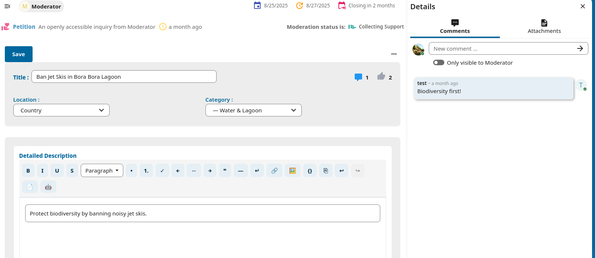
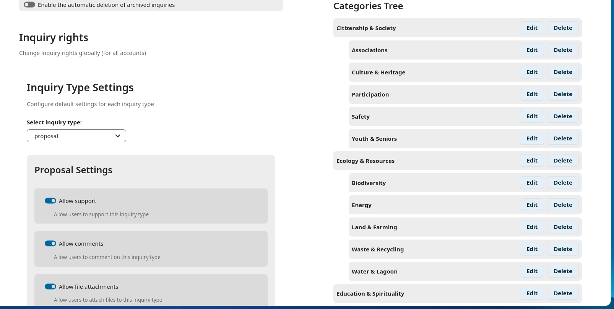
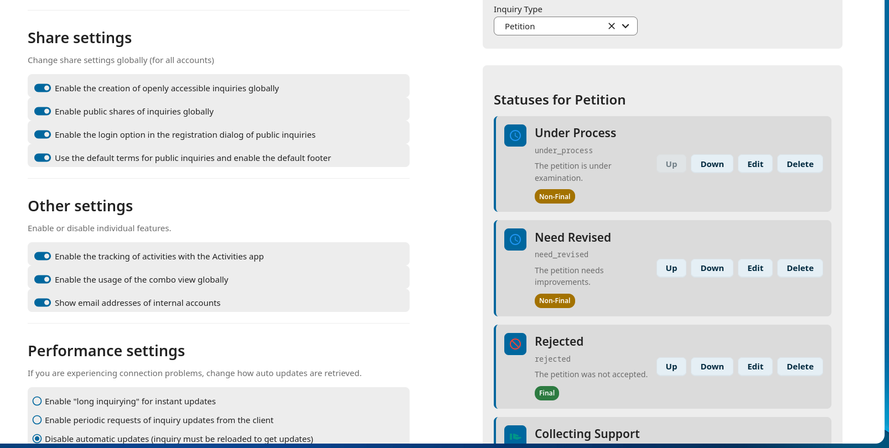
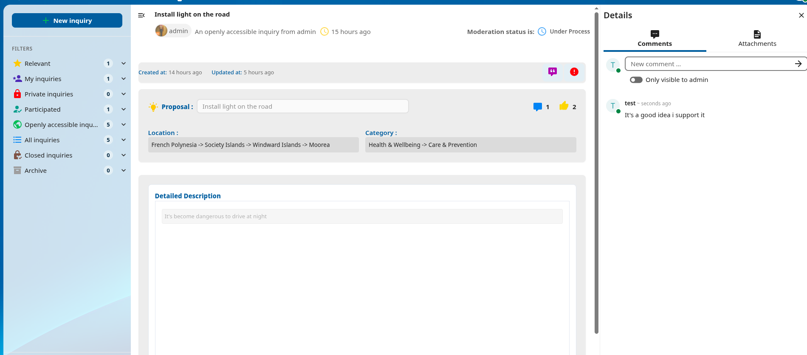
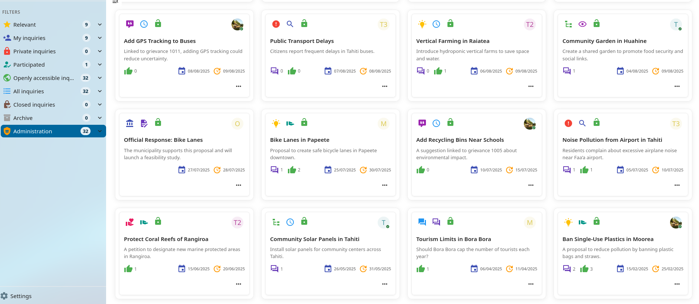

<!--
  - SPDX-FileCopyrightText: 2016 Nextcloud contributors
  - SPDX-License-Identifier: AGPL-3.0-or-later
-->

# Agora 1.1.0

[](https://dependabot.com)  
[](COPYING)  
[](https://api.reuse.software/info/github.com/vinimoz/agora)

Agora is a **Nextcloud app for participatory democracy**, built on [Nextcloud Polls](https://github.com/nextcloud/polls) and inspired by [Decidim](https://decidim.org/).  
It allows communities and organizations to collaborate on **proposals, debates, petitions, and projects** in a structured, inclusive way.

---

## 🌟 Features in 1.1.0

- 🔍 **Improved Search Bar** – Quickly find proposals, debates, or projects  
- 📝 **Create Contributions**  
  - 📌 **Proposals** – Suggest ideas or improvements  
  - 💬 **Debates** – Discuss and exchange opinions  
  - 📃 **Petitions** – Collect support for initiatives  
  - 🏗 **Projects** – Manage tasks or initiatives collaboratively  
- 💬 **Comments & Suggestions** – Shape ideas together  
- 🏷 **Sort by Category & Location** – Keep content organized  
- 🔒 **Private & Secure** – All data stays on your Nextcloud server

---

## 🚀 Why Agora?

Agora encourages **participation and collaboration** in small teams, community groups, or local initiatives.  
It simplifies decision-making, keeps discussions structured, and ensures **every voice counts**.

---

## 🐞 Known Issues

- Public share not fully tested  
- Tiptap images sometimes do not display

---

## 📥 Installation / Update

### Requirements

- Nextcloud 21+  
- PHP 8.1+

### Install Latest Release

Install directly from the [Nextcloud App Store](https://apps.nextcloud.com/apps/agora).

### From Git

```bash
git clone https://github.com/vinimoz/agora.git
cd agora
make setup-dev   # Dev environment
make setup-build # Runtime environment
npm run build    # Compile JS
make appstore    # Full build
occ app:enable agora
```

---

## ⚙ Useful OCC Commands

| Command | Description |
| ------- | ----------- |
| `agora:db:clean-migrations` | Remove obsolete migrations |
| `agora:db:purge` | Drop all Agora tables & config |
| `agora:db:rebuild` | Rebuild database including indices |
| `agora:db:init-default` | Create default categories, locations, moderation |
| `agora:index:create` | Create database indices |
| `agora:index:remove` | Remove indices |
| `agora:inquiry:transfer-ownership <source> <target>` | Transfer ownership of an inquiry |
| `agora:share:add / remove` | Add or remove user/group/email to shares |

---

## 🖼 Screenshots

| Edit Inquiry | Manage Category | Moderation Status | View as Non-owner | Grid View | List View |
| :----------: | :-------------: | :---------------: | :---------------: | :-------: | :-------: |
|  |  |  |  |  |  |

---

## 📚 Documentation

| User Guide | API Guide |
| :--------: | :-------: |
| [USER_GUIDE.md](docs/USER_GUIDE.md) | [API_v1.0.md](docs/API_v1.0.md) |

---

## 🛠 Support

- Report bugs or request features: [GitHub Issues](https://github.com/vinimoz/agora/issues)  
- Community support: [Nextcloud Help](https://help.vinimoz.com/c/apps/agora/)

---

## 🤝 Contribution

Please read our [Code of Conduct](https://vinimoz.com/community/code-of-conduct/) to ensure collaboration in a positive and respectful way.

---

## 🏷 Changelog Highlights for 1.1.0

- ✨ Added new **search bar** for fast filtering  
- 📝 Minor UI improvements  
- 🐞 Bug fixes: comments display, image handling in Tiptap

